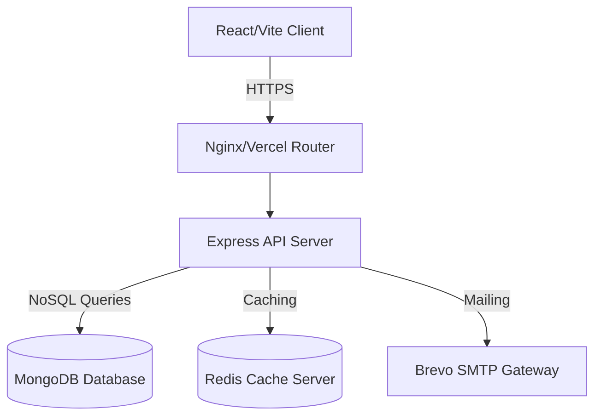

# Architecture Overview

This document describes the high-level architecture of FixNearby.

## System Diagram

## Component Overview
- **Client**: Build on React SPA with Vite, styled using Tailwind CSS.
- **Server**: Express.js REST APIs with robust middleware.
